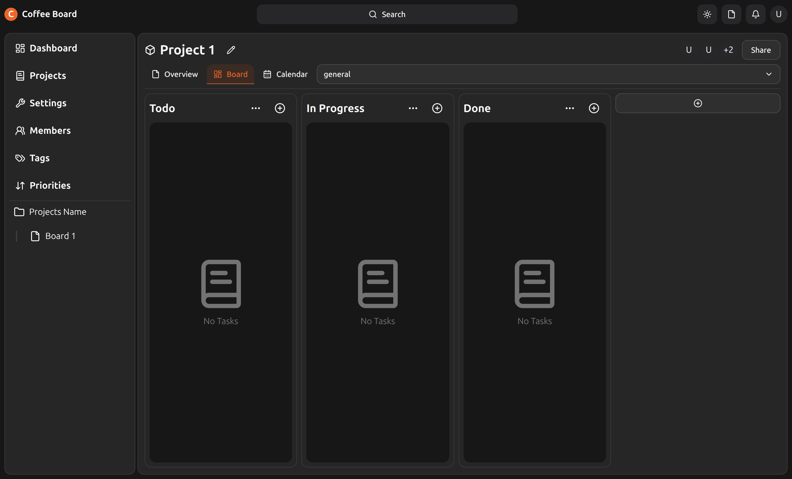

# Coffee board



A kanban board for managing your projects. Easy to deploy and use.

Made using nextjs, typescript, tailwindcss.

## Table of contents

- [Features](#features)
- [Demo](#demo)
- [Installation](#installation)
- [Usage](#usage)
- [Contributing](#contributing)
- [License](#license)

# Features

Here a list of the features of this project (WIP):

- Multi projects support
- Multi users support
- Multi tags support for all projects and specific projects
- Multi priority support for all projects and specific projects
- Multi boards support for each project

# Demo

WIP

# Installation

We are working to add a docker image for this project to make it easy to
try it out.

Before continuing, make sure you have the following installed:

- Nodejs
- Docker
- Pnpm (or npm, but we recommend using pnpm)

Right now you can test the project by running the following commands:

1. Clone the repo

```bash
# Clone the repo using ssh
git clone git@github.com:Caresle/coffee-board.git

# or using https
git clone https://github.com/Caresle/coffee-board.git
```

2. Install the dependencies

```bash
cd apps/coffee-board

pnpm install # or npm install
```

3. Copy the .env.example file to .env

```bash
cp .env.example .env
```

4. Replace the values in the .env file with your own, by default we use the default ports and values for the services running in docker compose.

5. Run the docker compose file

```bash
docker compose up -d
```

6. Run the application

```bash
# Dev environment
pnpm dev # or npm run dev

# Build and start the application
pnpm run build:nolint && pnpm run start
```

# Usage

WIP

# Contributing

Thank you for considering contributing to this project. Please read our
[contributing guidelines](CONTRIBUTING.md) to get started.

# License

This project is licensed under the MIT License - see the [LICENSE](LICENSE) file for details
